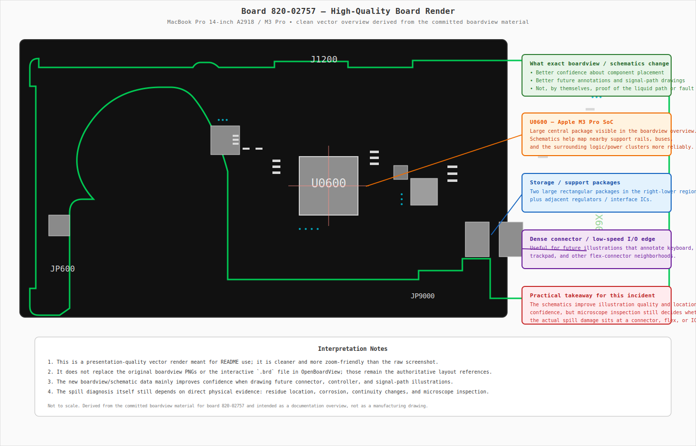
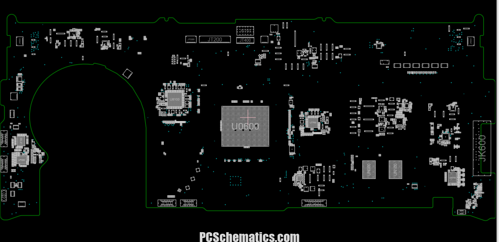
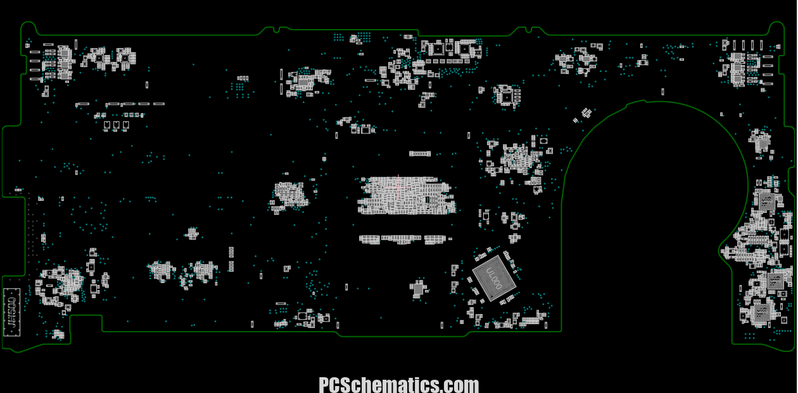
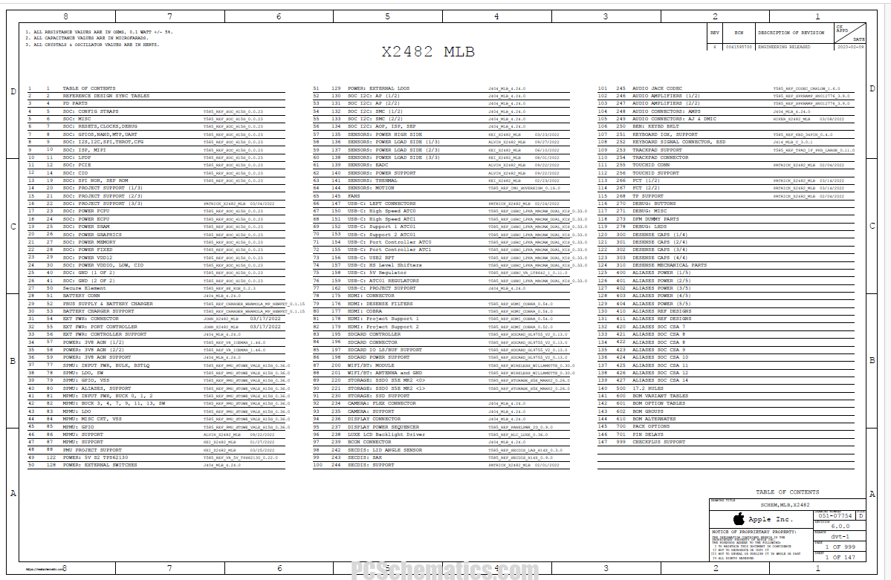
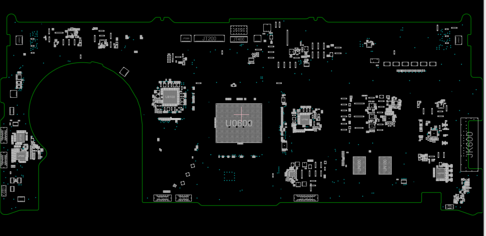
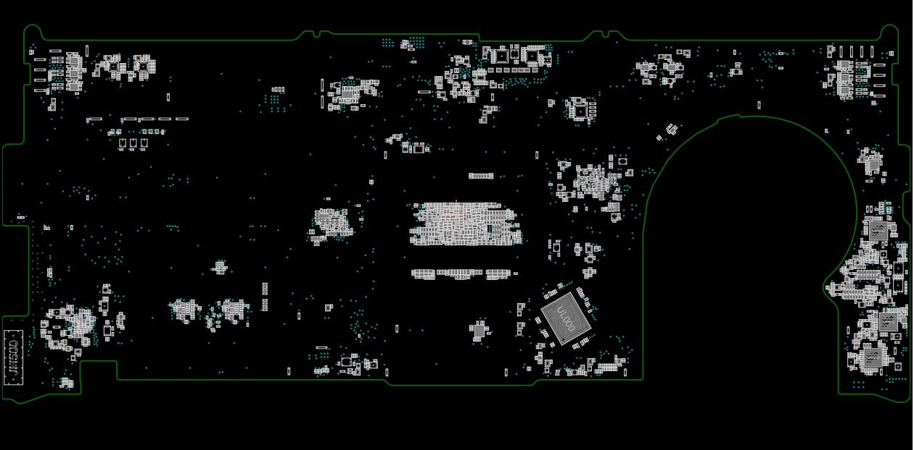

# Apple and Cola Incident

## Incident Description

On March 18, a Coca-Cola Zero was spilled over an Apple MacBook Pro M3 Pro. The owner, unfamiliar with macOS, attempted to power it off but accidentally put it to sleep instead. The laptop was then gently wiped, a napkin was placed between the screen and keyboard, and it was positioned upside down for approximately 30 minutes to allow liquid to drain.

After waiting, the MacBook did not turn on, so it was taken to a service center. The service center was able to power it on, at which point it was immediately shut down again. The technicians spent about 2 hours cleaning the device.

## Device Identification

| Field | Value |
|---|---|
| Serial number | MWJPXQ4VC4 |
| Model | MacBook Pro 14-inch (M3 Pro, November 2023) |
| Model number | A2918 |
| EMC number | EMC 8304 |
| Logic board | 820-02757 |
| Processor | Apple M3 Pro (11-core CPU / 14-core GPU) |
| Display | 14.2" Liquid Retina XDR, 3024 × 1964 |
| Keyboard type | Scissor-switch (Magic Keyboard), integrated into top-case assembly |

The serial prefix **MWJ** identifies a 2024-batch MacBook Pro 14" with M3 Pro chip. The logic board number **820-02757** is the key identifier for locating component-level schematics and boardview files (see [Board-Level Schematic References](#board-level-schematic-references) below).

## Observed Symptoms

Upon receiving the device back from the service center:

- Key **N** did not work.
- The service center indicated keyboard replacement would be required, citing a "mechanical issue" — later clarified to mean that the individual key switch blocks are sealed units that cannot be manually cleaned; residue trapped inside them cannot be reached by conventional methods.
- After returning home, the entire column containing **H**, **Y**, **6**, and **N** was affected.
- **N** was producing incorrect characters (a **/** symbol and other unintended characters) instead of or in addition to `N`.
- Extra symbols were appearing spontaneously from the keyboard without any keys being pressed.
- Over the following days the picture evolved: **N** now produces 3 different symbols (including `N` itself), and similar multi-character behavior is present for the other keys in the affected column.
- **Ghost keypresses subsequently disappeared** — spontaneous phantom key events stopped after the residue dried and stabilised.
- **Partial improvement after rest period** (updated March 22): after 2 days of non-use (internal keyboard disabled via Karabiner Elements while using an external keyboard), the affected keys now produce **correct symbols plus two incorrect ones** (previously, correct symbols were intermittent or absent). This suggests the contamination may be partially dissipating or redistributing during periods without thermal cycling from laptop use.

## Keyboard Mechanisms: Butterfly vs Scissor

Before diving into the electronics, it is worth clarifying the two keyboard mechanism types Apple has used, since the service center discussion references "non-serviceable key blocks":

### Butterfly mechanism (2015–2019, now discontinued)

The **butterfly mechanism** was Apple's ultra-thin key switch design used in the MacBook 12" (2015–2017) and MacBook Pro 13"/15" (2016–2019). It uses a **V-shaped pair of interlocking wings** (resembling a butterfly) that pivot at a single central point. When the keycap is pressed, the wings fold flat; when released, they spring back.

Key characteristics:
- **Extremely thin** — only ~0.55 mm key travel, enabling very slim laptop designs.
- **Fragile** — notorious for failures caused by dust, crumbs, or debris getting trapped under the mechanism, causing stuck or unresponsive keys.
- **Recalled** — Apple acknowledged the reliability problems and offered a free keyboard repair program for affected models.
- **Discontinued** — replaced by the scissor mechanism starting with the MacBook Pro 16" in late 2019.

> ⚠️ **Your MacBook (M3 Pro, 2023) does NOT use the butterfly mechanism.** It uses the scissor mechanism described below.

### Scissor mechanism (2019–present, your MacBook)

The **scissor mechanism** (marketed as "Magic Keyboard") is Apple's current keyboard design, used in all MacBooks since late 2019 including the M1, M2, and M3 generations. It uses an **X-shaped pair of interlocking plastic arms** (resembling scissors) that cross and pivot at the center. The arms clip into the keycap above and a base plate below, providing a stable, guided vertical motion.

Key characteristics:
- **More key travel** — approximately 1 mm, which feels more tactile than the butterfly design.
- **More reliable** — the X-shaped mechanism is less susceptible to dust and debris failures.
- **Still sealed** — the scissor arms, rubber dome, and FPC membrane layer form a sealed unit. Once liquid enters the sub-0.3 mm capillary gaps, it cannot be removed by manual cleaning — only by ultrasonic cavitation.
- **Integrated into the top-case** — the keyboard, battery, and palm rest are a single assembly. Replacing the keyboard means replacing the entire top-case.

See the [butterfly vs scissor comparison diagram](diagrams/butterfly-vs-scissor.svg) and [scissor-switch cross-section](diagrams/scissor-switch-cross-section.svg) for visual details.

## Keyboard Electronics: Schematics and Layout

### 1. Keyboard Matrix Principle

MacBook keyboards use a **row/column matrix** to detect keypresses. Each key sits at the intersection of one row wire and one column wire. The keyboard controller scans all rows one at a time and reads which column lines are active. This means:

- One **column** trace is shared by all keys in the same vertical column on the keyboard.
- One **row** trace is shared by all keys in the same horizontal row.
- A keypress is detected when a specific (row, column) pair is simultaneously active.

**From the board 820-02757 boardview data** (decoded from `820-02757-06-boardview.brd`): the keyboard matrix on this MacBook Pro is **12 rows × 13 columns**, with signal names `KBD_DRIVE_Y0`–`KBD_DRIVE_Y11` (rows) and `KBD_SENSE_X0`–`KBD_SENSE_X12` (columns). Three additional modifier keys (`KBD_CONTROL_KEY`, `KBD_LEFT_OPTION_KEY`, `KBD_RIGHT_SHIFT_KEY`) have dedicated lines outside the matrix.

```
          COL_A   COL_B   COL_C   COL_D   COL_E   COL_F
           |       |       |       |       |       |
ROW_1 ---[Tab]---[Q]-----[W]-----[E]-----[R]-----[T]--- ...
           |       |       |       |       |       |
ROW_2 ---[CpsLk]-[A]-----[S]-----[D]-----[F]-----[G]--- ...
           |       |       |       |       |       |
ROW_3 ---[Shift]-[Z]-----[X]-----[C]-----[V]-----[B]--- ...
           |       |       |       |       |       |
          ...     ...     ...     ...     ...     ...
```

Each intersection square `[KEY]` contains a tiny rubber dome or scissor-switch membrane that, when pressed, electrically connects the row wire to the column wire at that point.

### 2. Affected Column in the Keyboard Matrix

The keys **6**, **Y**, **H**, and **N** all sit in the **same column** on the physical MacBook keyboard layout. They are connected to a single column trace that runs vertically through the keyboard membrane/FPC from top to bottom:

```
  Physical keyboard (excerpt of the affected area)
  ┌─────┬─────┬─────┬─────┬─────┬─────┬─────┬─────┐
  │  5  │ [6] │  7  │  8  │  9  │  0  │  -  │  =  │  ← number row
  ├─────┼─────┼─────┼─────┼─────┼─────┼─────┼─────┤
  │  T  │ [Y] │  U  │  I  │  O  │  P  │  [  │  ]  │  ← top letter row
  ├─────┼─────┼─────┼─────┼─────┼─────┼─────┼─────┤
  │  G  │ [H] │  J  │  K  │  L  │  ;  │  '  │Enter│  ← home row
  ├─────┼─────┼─────┼─────┼─────┼─────┼─────┼─────┤
  │  B  │ [N] │  M  │  ,  │  .  │  /  │     │     │  ← bottom row
  └─────┴─────┴─────┴─────┴─────┴─────┴─────┴─────┘
           ▲
           │
     Affected column trace (shared by 6, Y, H, N)
```

A single conductive contamination or corrosion point anywhere along this column trace (or at the connector pin that carries it) will affect all four keys simultaneously.

### 3. Keyboard Flex Cable (FPC) and Connector

The MacBook keyboard is built into a large **Flexible Printed Circuit (FPC)** — a thin, ribbon-like PCB that carries all the row and column traces from the key matrix down to a connector at the bottom of the top-case assembly.

```
  Top-case assembly (schematic side view)
  ┌──────────────────────────────────────────────────┐
  │          K E Y B O A R D   K E Y S               │
  │   [key][key][key][key][key][key][key][key][key]   │
  │   [key][key][key][key][key][key][key][key][key]   │
  │   [key][key][key][key][key][key][key][key][key]   │
  │   [key][key][key][key][key][key][key][key][key]   │
  └────────────────────┬─────────────────────────────┘
                       │  FPC ribbon cable
                       │  (carries ~30–34 row/col traces)
                       │
              ┌────────┴────────┐
              │  ZIF Connector  │  ← Zero Insertion Force socket
              │  on logic board │    on top-case or directly on
              └────────┬────────┘    the logic board ribbon
                       │
              ┌────────┴────────┐
              │  Keyboard       │
              │  Controller IC  │  ← scans matrix, reports
              └─────────────────┘    keypresses over SPI/I2C
                                     to the Apple Silicon SoC
```

#### ZIF Connector Detail

A ZIF (Zero Insertion Force) connector has a row of gold-plated pads on the FPC that line up with spring contacts inside the socket. A locking latch clamps the cable in place. If the FPC is:

- **Inserted at a slight offset**: one or more pins shift, and a column or row trace connects to the wrong controller input pin — causing wrong characters.
- **Not fully inserted**: contact resistance is high or intermittent, causing missing or unreliable keypresses.
- **Inserted upside-down** (some cables are not keyed): the pin order is completely reversed, producing systematic wrong-character output across many keys.

```
  FPC edge (viewed from below, 34-pin example — simplified)

  ┌──┬──┬──┬──┬──┬──┬──┬──┬──┬──┬──┬──┬──┬──┬──┬──┬──┐
  │R1│R2│R3│R4│R5│R6│C1│C2│C3│C4│C5│C6│C7│C8│C9│..│Gnd│
  └──┴──┴──┴──┴──┴──┴──┴──┴──┴──┴──┴──┴──┴──┴──┴──┴──┘
   ▲                       ▲
   Row traces               Column traces
   (one per keyboard row)   (one per keyboard column)

  Each pad is ~0.5 mm wide with ~0.5 mm pitch — very easy to
  misalign by one position during re-insertion.
```

The following diagrams show what the physical connector looks like — both the socket on the logic board and the FPC ribbon end that plugs into it:

```
  ZIF socket on logic board (top view, latch open — ready to accept FPC)

        latch (open / raised)
        ╔═══════════════════════════════════════╗
        ║                                       ║
        ╠═══════════════════════════════════════╣  ← hinge line
        │ · · · · · · · · · · · · · · · · · · · │  ← spring contacts
        │_ _ _ _ _ _ _ _ _ _ _ _ _ _ _ _ _ _ _ _│  ← FPC insertion slot
        └───────────────────────────────────────┘
         ↑ FPC ribbon slides in here, flat side down

  ZIF socket on logic board (top view, latch closed — FPC clamped)

        latch (closed / rotated down, locks FPC)
        ┌───────────────────────────────────────┐
        │▓▓▓▓▓▓▓▓▓▓▓▓▓▓▓▓▓▓▓▓▓▓▓▓▓▓▓▓▓▓▓▓▓▓▓▓▓▓▓│  ← latch pressed down
        │ · · · · · · · · · · · · · · · · · · · │  ← contacts gripping FPC pads
        │▔▔▔▔▔▔▔▔▔▔▔▔▔▔▔▔▔▔▔▔▔▔▔▔▔▔▔▔▔▔▔▔▔▔▔▔▔▔▔│
        └───────────────────────────────────────┘

  Side cross-section (latch closed):

          FPC ribbon
         ┌────────────────────────────────────┐
         │ polyimide film │▐▌▐▌▐▌▐▌▐▌▐▌ pads  │  ← gold-plated copper pads
         └────────────────┴──────────────────-┘
                                 ↕ contact force from latch
         ┌───────────────────────────────────┐
         │  spring contacts inside socket    │  ← socket body, soldered to PCB
         └───────────────────────────────────┘
              ↑ logic board PCB
```

### 4. How Liquid Damage Causes the Observed Symptoms

The following diagram illustrates where cola can bridge traces and produce the observed multi-character and ghost-key behavior:

```
  FPC cross-section (schematic, not to scale)

  ┌─────────────────────────────────────────────────────┐
  │  Polyimide substrate (insulating base layer)         │
  ├────────────┬────────────────────┬────────────────────┤
  │  COL_D     │      COL_E         │      COL_F          │  ← copper traces
  │  (6,Y,H,N) │    (adjacent col)  │    (adjacent col)   │
  └────────────┴────────────────────┴────────────────────┘

  After cola spill and drying:

  ┌─────────────────────────────────────────────────────┐
  │  Polyimide substrate                                 │
  ├────────────┬═══════════════════ ┬────────────────────┤
  │  COL_D     ║   dried cola +    ║      COL_F          │
  │  (6,Y,H,N) ║   corrosion       ║                     │
  └────────────╩═══════════════════╩────────────────────┘
               ▲
               Conductive bridge between COL_D and COL_E
               → pressing any key in COL_D also activates
                 a COL_E signal → wrong extra character output
               → residual conductivity even when no key is
                 pressed → spontaneous ghost keypresses
```

### 5. Physical Location of the Connector on an M3 Pro MacBook

On the MacBook Pro M3, the keyboard FPC runs from the key area down to the **lower portion of the top-case**, where it connects to the logic board via a ZIF socket located roughly in the center-bottom of the top-case interior. Liquid spilled on the keyboard travels downward by gravity and capillary action, meaning the **connector and the lower portion of the FPC** are among the most likely sites for residue accumulation — consistent with all affected keys being in a single vertical column rather than a single horizontal row.

### 6. Affected Block Schematics (Model A2918 / Board 820-02757)

The following diagrams show the specific signal blocks affected in this incident on the MacBook Pro 14" M3 Pro (A2918), based on the keyboard system architecture for board 820-02757.

#### 6a. Keyboard System Block Diagram

```
  ┌─────────────────────────────────────────────────────────────────────┐
  │                    MacBook Pro 14" M3 Pro (A2918)                   │
  │                    Board: 820-02757 / EMC 8304                     │
  ├─────────────────────────────────────────────────────────────────────┤
  │                                                                     │
  │   ┌─────────────────────────────────────────────┐                  │
  │   │         KEYBOARD ASSEMBLY (top-case)        │                  │
  │   │                                             │                  │
  │   │  ┌─────────────────────────────────────┐   │                  │
  │   │  │  Key Matrix (~6 rows × 16 columns)  │   │                  │
  │   │  │  ┌───┬───┬───┬───┬───┬───┬───┐      │   │                  │
  │   │  │  │R1 │R2 │R3 │R4 │R5 │R6 │...│ rows │   │                  │
  │   │  │  ├───┼───┼───┼───┼───┼───┼───┤      │   │                  │
  │   │  │  │C1 │C2 │...│C7 │...│C15│C16│ cols │   │                  │
  │   │  │  └───┴───┴───┴─▲─┴───┴───┴───┘      │   │                  │
  │   │  │                │                     │   │                  │
  │   │  │         [AFFECTED COLUMN C7]         │   │                  │
  │   │  │          6 — Y — H — N               │   │                  │
  │   │  └──────────────────┬──────────────────┘   │                  │
  │   │                     │ FPC ribbon cable      │                  │
  │   │                     │ (polyimide flex,      │                  │
  │   │                     │  ~30-34 traces)       │                  │
  │   └─────────────────────┼───────────────────────┘                  │
  │                         │                                           │
  │                    ┌────┴─────┐                                     │
  │                    │   ZIF    │  ZIF connector on top-case          │
  │                    │ connector│  or logic board flex cable          │
  │                    └────┬─────┘                                     │
  │                         │                                           │
  │   ┌─────────────────────┴─────────────────────┐                    │
  │   │     KEYBOARD CONTROLLER IC                │                    │
  │   │     (dedicated MCU in top-case assembly)  │                    │
  │   │                                           │                    │
  │   │  ┌─────────────────────────────────────┐  │                    │
  │   │  │  Row driver outputs  (active scan)  │  │                    │
  │   │  │  Column sense inputs (read matrix)  │──┼── [C7 affected]   │
  │   │  │  Backlight LED PWM driver           │  │                    │
  │   │  │  Key debounce + ghost-key logic     │  │                    │
  │   │  └─────────────────────────────────────┘  │                    │
  │   └───────────────────┬───────────────────────┘                    │
  │                       │  SPI bus                                    │
  │                       │  (MOSI, MISO, SCK, CS)                     │
  │                       │                                             │
  │   ┌───────────────────┴───────────────────────┐                    │
  │   │        APPLE M3 PRO SoC                   │                    │
  │   │   (receives keypress data via SPI,         │                    │
  │   │    passes to macOS HID subsystem)          │                    │
  │   └───────────────────────────────────────────┘                    │
  │                                                                     │
  └─────────────────────────────────────────────────────────────────────┘
```

#### 6b. FPC Connector Pinout — Affected Column Highlighted

The keyboard FPC carries all row and column signals to the controller IC. The affected column (C7, carrying keys 6/Y/H/N) is a single pin on the FPC/ZIF connector. Contamination at this pin or along the C7 trace causes all four keys to malfunction simultaneously:

```
  FPC pinout (simplified 34-pin model, viewed from below)

  Pin:  1   2   3   4   5   6   7   8   9  10  11  12  13  14  15  16  17
       ┌──┬──┬──┬──┬──┬──┬──┬──┬──┬──┬──┬──┬──┬──┬──┬──┬──┐
       │R1│R2│R3│R4│R5│R6│C1│C2│C3│C4│C5│C6│C7│C8│C9│..│Gnd│
       └──┴──┴──┴──┴──┴──┴──┴──┴──┴──┴──┴──┴──┴──┴──┴──┴──┘
                                              ▲▲▲
                                              │││
       Affected pin C7 ───────────────────────┘││
       Adjacent pin C6 (bridged by residue) ───┘│
       Adjacent pin C8 (possibly bridged) ──────┘

       When dried cola bridges C7 to C6 (or C8):
       → pressing any key in column 7 (6,Y,H,N) also activates
         column 6 (or 8) → extra characters appear
       → residual conductivity between C7 and adjacent pins
         without a keypress → ghost keypresses (now resolved)
```

#### 6c. Signal Path from Affected Keys to SoC

```
  Affected key "N" pressed:
  ═══════════════════════════════════════════════════════════

  [N key]  (physical keypress)
      │
      ▼
  [Scissor switch collapses, rubber dome presses FPC membrane]
      │
      ▼
  [FPC contact pad closes ROW_4 × COL_7 intersection]
      │                              │
      │                              │ ← dried cola residue
      │                              │   bridges COL_7 to COL_6
      │                              │
      ▼                              ▼
  COL_7 signal active           COL_6 signal ALSO active
      │                              │
      │        ┌─────────────────────┤
      ▼        ▼                     │
  [FPC trace → ZIF connector pin 13] │
      │        │                     │
      │   [ZIF connector pin 12] ◄───┘  (contamination here or
      │        │                         along the FPC trace)
      ▼        ▼
  ┌──────────────────────────────────────────────────┐
  │   Keyboard Controller IC                         │
  │                                                  │
  │   Scans ROW_4 → reads COL_7 ──► reports "N"     │
  │                   reads COL_6 ──► reports extra   │
  │                   reads COL_8? ─► reports extra   │
  │                                                  │
  │   Result: controller sends                       │
  │   multiple keycodes for one                      │
  │   physical keypress                              │
  └──────────────────────┬───────────────────────────┘
             │ SPI bus
             ▼
  ┌──────────────────────────────────┐
  │   Apple M3 Pro SoC               │
  │   → macOS receives "N" + "/" + ? │
  │   → all three appear on screen   │
  └──────────────────────────────────┘
```

#### 6d. Logic Board Keyboard Area Layout (Board 820-02757)

```
  MacBook Pro 14" A2918 logic board (simplified top view)
  ┌──────────────────────────────────────────────────────────────────┐
  │                                                                  │
  │    ┌──────────────────────┐        ┌─────────────────┐          │
  │    │                      │        │  Thunderbolt /   │          │
  │    │    Apple M3 Pro      │        │  USB-C ports     │          │
  │    │    SoC (main chip)   │        └─────────────────┘          │
  │    │                      │                                      │
  │    │   ┌──────────────┐   │                                      │
  │    │   │ SPI keyboard │   │                                      │
  │    │   │ interface    │   │                                      │
  │    │   └──────┬───────┘   │                                      │
  │    └──────────┼───────────┘                                      │
  │               │ SPI traces on PCB                                │
  │               │                                                  │
  │    ┌──────────┴──────────┐                                       │
  │    │  Keyboard Controller│  ← dedicated IC near keyboard         │
  │    │  IC (MCU)           │    connector area                     │
  │    │  scans matrix,      │                                       │
  │    │  sends SPI to SoC   │                                       │
  │    └──────────┬──────────┘                                       │
  │               │ short PCB traces                                 │
  │               │                                                  │
  │    ╔══════════╧══════════╗  ← ════════════════════════════════   │
  │    ║  ZIF CONNECTOR      ║    CONTAMINATION LIKELY HERE          │
  │    ║  (keyboard FPC      ║    or along the FPC trace below       │
  │    ║   plugs in here)    ║  ← ════════════════════════════════   │
  │    ╚═════════════════════╝                                       │
  │               ▲                                                  │
  │               │ FPC ribbon cable                                 │
  │               │ (exits to top-case                               │
  │               │  keyboard assembly)                              │
  │                                                                  │
  │    ┌──────────────────┐   ┌───────────────────┐                 │
  │    │ Trackpad          │   │ Battery connector │                 │
  │    │ connector         │   │                   │                 │
  │    └──────────────────┘   └───────────────────┘                 │
  │                                                                  │
  └──────────────────────────────────────────────────────────────────┘
```

### 7. Board-Level Schematic References

For the MacBook Pro 14" A2918 (board **820-02757**, design **051-07754**), the following resources provide component-level schematics and boardview files that show the exact keyboard controller IC location, FPC connector pinout, and trace routing:

| Resource | URL | Contents |
|---|---|---|
| Apple Self-Service Repair Manual | https://support.apple.com/en-us/118617 | Exploded views, connector locations, part numbers (no circuit schematics) |
| NotebookSchematics (820-02757) | https://notebookschematics.com/macbook-pro-14-a2918-2023-m3-schematic-boardview-820-02757-schematic-boardview/ | PDF schematic + BRD boardview file |
| LaptopSchematic (820-02757) | https://www.laptopschematic.com/apple-macbook-pro-14-m3-a2918-2023-820-02757-schematic-boardview/ | PDF schematic + boardview |
| PCSchematics (051-07754) | https://pcschematics.com/apple-macbook-pro-14%E2%80%B3-a2918-2023-m3-820-02757-051-07754-schematic-boardview/ | Schematic and boardview download |
| RepairLap forum (EMC 8304) | https://www.repairlap.com/threads/apple-macbook-pro14-m3-a2918-2023-emc8304-820-02757-boardview-schematics.28192/ | Community-posted boardview + schematic files |
| LogiWiki board number index | https://logi.wiki/index.php/Board_Number_by_A_Number | Cross-reference A-number → board number |
| iFixit teardown (14" M3) | https://www.ifixit.com/Teardown/MacBook+Pro+14-Inch+2023+Teardown/169486 | High-res teardown photos of A2918 internals |

**Note:** The BRD boardview files require a viewer such as **OpenBoardView** (free, open-source) or **FlexBV** to navigate the component layout interactively. The PDF schematics show the full circuit including the keyboard controller IC (typically labeled as a "U"-prefixed component near the keyboard ZIF connector), SPI bus connections to the M3 Pro SoC, and individual column/row signal names.

### 8. Diagrams (uploaded as files)

The following diagrams are included in this repository in the [`diagrams/`](diagrams/) directory, available in both SVG (vector, scalable) and PNG (raster, 1200px wide) formats:

| Diagram | SVG | PNG | Description |
|---|---|---|---|
| Keyboard matrix with affected column | [SVG](diagrams/keyboard-matrix-affected-column.svg) | [PNG](diagrams/keyboard-matrix-affected-column.png) | Row/column matrix layout showing keys 6, Y, H, N sharing column C7 (highlighted in red) |
| Keyboard system block diagram | [SVG](diagrams/keyboard-system-block-diagram.svg) | [PNG](diagrams/keyboard-system-block-diagram.png) | Full signal chain: key matrix → FPC ribbon → ZIF connector → keyboard controller IC → SPI → M3 Pro SoC |
| ZIF connector detail (3 views) | [SVG](diagrams/zif-connector-detail.svg) | [PNG](diagrams/zif-connector-detail.png) | Top view (latch open), top view (latch closed), and side cross-section showing FPC pads contacting spring contacts |
| FPC liquid damage | [SVG](diagrams/fpc-liquid-damage.svg) | [PNG](diagrams/fpc-liquid-damage.png) | Before/after comparison showing how dried cola bridges column traces C7→C6/C8 |
| Scissor-switch cross-section | [SVG](diagrams/scissor-switch-cross-section.svg) | [PNG](diagrams/scissor-switch-cross-section.png) | Side view of the non-serviceable key block: keycap → scissor arms → rubber dome → FPC membrane |
| Butterfly vs scissor comparison | [SVG](diagrams/butterfly-vs-scissor.svg) | [PNG](diagrams/butterfly-vs-scissor.png) | Side-by-side comparison of the two Apple keyboard mechanisms |
| Chemical attack cross-section | [SVG](diagrams/chemical-attack-cross-section.svg) | | FPC layer stack showing protected vs exposed zones and four chemical attack vectors (pinhole undermining, ionic bridging, osmotic blistering, copper dissolution) |
| Chemical timeline — three phases | [SVG](diagrams/chemical-timeline-phases.svg) | | Wet → drying → dried residue phases with key reactions, plus corrosion rate vs time graph showing peak during drying |
| Galvanic corrosion cell | [SVG](diagrams/galvanic-corrosion-cell.svg) | | Electrochemical cell at a solder/copper/gold bimetallic junction in cola electrolyte, with galvanic series table |
| Dendrite / electrochemical migration | [SVG](diagrams/dendrite-electrochemical-migration.svg) | | Three-step process: Cu dissolution at anode → ion migration → Cu deposition and dendrite growth at cathode, leading to permanent trace bridge |
| Connector chemical vulnerability | [SVG](diagrams/connector-chemical-vulnerability.svg) | | ZIF connector cross-section annotated with all six overlapping chemical vulnerability factors |
| Boardview 820-02757 — overview | | [PNG](diagrams/boardview-820-02757-overview.png) | PCSchematics boardview: full board layout showing M3 Pro SoC (U0600), keyboard controller area, and connector locations |
| Boardview 820-02757 — detail 1 | | [PNG](diagrams/boardview-820-02757-detail-1.png) | PCSchematics boardview: zoomed detail view of board area |
| Boardview 820-02757 — detail 2 | | [PNG](diagrams/boardview-820-02757-detail-2.png) | PCSchematics boardview: zoomed detail view of board area |
| Boardview 820-02757 — capture 1 | | [PNG](diagrams/boardview-820-02757-capture1.png) | Original PCSchematics screenshot from archive |
| Boardview 820-02757 — capture 2 | | [PNG](diagrams/boardview-820-02757-capture2.png) | Original PCSchematics screenshot from archive |
| Board 820-02757 — high-quality render | [SVG](diagrams/boardview-820-02757-render.svg) | | Clean vector board render for presentation/annotation use, derived from the boardview overview |
| Boardview 820-02757 data file | | [BRD](diagrams/820-02757-06-boardview.brd) | OpenBoardView-compatible boardview data file for board 820-02757-06 |

### 9. Boardview Screenshots (Board 820-02757)

The following screenshots were captured from the **PCSchematics** boardview for board **820-02757** (MacBook Pro 14" A2918, M3 Pro). They show the component layout as rendered in the boardview viewer:

Knowing the exact boardview / schematic set **does help**, but mostly by improving **placement confidence** and enabling **better illustrations**. It does **not automatically change the root-cause conclusion** for this incident on its own: the actual failure site still has to be confirmed by physical evidence such as residue location, corrosion, and continuity/microscope inspection.

It also does **not materially change the hypothesis ranking / chance estimates** yet. At most, it gives a **small confidence boost** to a shared-trace / connector-path explanation over a random controller-IC fault, because the boardview supports cleaner physical localisation of the keyboard signal path. The dominant evidence is still the symptom pattern itself: one affected matrix column, multi-character output, progression over time, and partial improvement after rest.

Likewise, the boardview does **not by itself explain the unidirectional key-mapping behavior**. That one-way behavior is still better explained by a **near-threshold resistive bridge** in the keyboard matrix / FPC path together with **scan timing** and **asymmetric residue geometry**, not by anything visible in the logic-board overview alone. To change that conclusion, we would need more specific keyboard-matrix or top-case trace data, not just the main logic-board boardview.

This repository now also includes a **high-quality vector board render** derived from the boardview material for documentation and future annotation work:









The following additional screenshots and the boardview data file were provided in [Archive.zip](https://github.com/user-attachments/files/26164995/Archive.zip):





The boardview data file [`820-02757-06-boardview.brd`](diagrams/820-02757-06-boardview.brd) can be opened in [OpenBoardView](https://github.com/OpenBoardView/OpenBoardView) or similar boardview software for interactive component lookup.

### 10. Reference Photos of Real Hardware (external links)

The following links show actual teardown photos of MacBook Pro hardware similar to the M3 Pro model. These illustrate the real-world appearance of the components described in the ASCII schematics above:

**Keyboard FPC ribbon cable and ZIF connector:**
- iFixit MacBook Pro 14" M3 teardown — top-case interior showing the keyboard FPC ribbon routing and ZIF connector location: https://www.ifixit.com/Teardown/MacBook+Pro+14-Inch+2023+Teardown/169486
- iFixit MacBook Pro 16" keyboard replacement guide — close-up of the ZIF socket with latch open/closed and FPC insertion: https://www.ifixit.com/Guide/MacBook+Pro+16-Inch+2021+Keyboard+Replacement/148094

**Scissor-switch key mechanism (non-serviceable block):**
- iFixit MacBook Pro keyboard key replacement — photos of the scissor arms, rubber dome, and mounting clips from above and side angles: https://www.ifixit.com/Guide/MacBook+Pro+Retina+Keyboard+Key+Replacement/111942
- Apple scissor mechanism patent diagram (publicly available via Google Patents): https://patents.google.com/patent/US10490364B2 — shows the interlocking arm design and capillary-scale clearances

**Liquid damage on FPC traces (similar incidents):**
- iFixit liquid damage guide — photos showing corrosion and residue on logic board traces and connectors after a liquid spill: https://www.ifixit.com/Wiki/Liquid_Damage
- Rossmann Group YouTube channel frequently shows close-up microscope footage of cola/coffee damage on MacBook flex cables and connectors — search "Rossmann MacBook liquid damage keyboard" for representative examples

## Service Center's Position: "Non-Serviceable Key Blocks"

The service center has clarified what they mean by "mechanical issue": the individual key switch assemblies on modern MacBook keyboards are sealed units. Once liquid wicks into the tiny capillary space between the keycap, scissor-switch mechanism, and underlying membrane substrate, it cannot be removed by manual cleaning (swabbing, compressed air, or partial disassembly). This is technically accurate — the scissor-switch mechanism sits over a rubber dome on top of the FPC, and the tolerances are so tight that manual access is impossible without destroying the switch.

The diagram below shows what a single scissor-switch key block looks like in cross-section, illustrating why it is considered non-serviceable:

```
  Single MacBook scissor-switch key (cross-section, side view)

       ┌──────────────────────────────┐
       │         K E Y C A P          │  ← hard plastic cap, snaps onto scissor arms
       └────────┬──────────┬──────────┘
               /            \
  scissor arm /  (X-shaped   \ scissor arm
             /   pivot joint) \
  ┌─────────┴──────────────────┴─────────┐
  │   scissor mechanism (plastic arms)   │  ← pivot clips into keycap and base plate
  └──────────────────┬───────────────────┘
                     │  compresses
                     ▼
             ┌───────────┐
             │ rubber    │  ← silicone dome (~2 mm diameter), acts as spring
             │  dome     │    AND electrical actuator
             └─────┬─────┘
                   │  presses
                   ▼
  ┌────────────────────────────────────────┐
  │           FPC membrane layer           │  ← two conductive layers separated by
  │  ┌────────────────────────────────┐   │     a thin non-conductive spacer with
  │  │  row trace ── contact ── col   │   │     a hole; dome press brings them together
  │  └────────────────────────────────┘   │
  └────────────────────────────────────────┘

  Why it is "non-serviceable":
  ┌──────────────────────────────────────────────────────────────┐
  │  The scissor arms clip tightly into the base plate below and  │
  │  the keycap above. Capillary gaps between these parts are     │
  │  typically < 0.3 mm — too small for any swab or tool to       │
  │  reach. Disassembling the scissor mechanism requires          │
  │  unclipping the fragile plastic arms, which break easily      │
  │  and cannot be reassembled to factory spec.                   │
  │                                                               │
  │  Liquid path into the switch:                                 │
  │  spill → between keycap edge and switch body                  │
  │         → down scissor arm channels (capillary action)        │
  │         → onto rubber dome and FPC contact area               │
  │         ← cannot be reversed without ultrasonic cavitation    │
  └──────────────────────────────────────────────────────────────┘
```

However, this framing has an important nuance:

- **The root cause of the observed symptoms** (entire column affected, multi-character output, ghost keypresses) points to contamination on the **FPC column trace or connector**, not inside individual key switch bodies. A faulty individual key mechanism would typically affect only that one key, not all four keys sharing a column.
- **Ultrasonic cleaning** uses high-frequency sound waves in a liquid bath (often isopropyl alcohol or a dedicated electronics solvent) to cause cavitation — microscopic bubbles that implode and dislodge residue from surfaces unreachable by any manual method, including inside sealed key switch bodies and under FPC traces. This is the correct treatment for this type of contamination.

The service center offers ultrasonic cleaning at approximately **1/3 the cost of keyboard replacement**, with a turnaround of **3–7 days**. Given that:

1. Ghost keypresses have already resolved (the residue has stabilized and is no longer migrating).
2. The column symptoms remain consistent and localized, suggesting a single contamination site.
3. Replacement would still be an option if cleaning fails.

**Ultrasonic cleaning is the recommended first step** — it addresses the actual likely root cause (FPC trace contamination), costs significantly less than replacement, and carries low risk of worsening the situation.

## Chemical Analysis of Coca-Cola Zero Residue

The spill chemistry matters here because **Coca-Cola Zero is still chemically damaging to electronic circuits even without sugar**. A typical Coca-Cola Zero / Coke Zero Sugar formulation contains:

| Ingredient | Chemical Formula | Percentage (Estimated/Approx.) |
|---|---|---|
| Carbonated Water | H₂O + CO₂ | ~90% |
| Carbon Dioxide | CO₂ | ~0.5–1% (volume dependent) |
| Caramel Color | Complex polymers (E150d) | ~0.1–0.2% |
| Phosphoric Acid | H₃PO₄ | ~0.05–0.07% |
| Aspartame | C₁₄H₁₈N₂O₅ | ~0.024% (87 mg per 12 oz) |
| Acesulfame Potassium | C₄H₄KNO₄S | ~0.013% (47 mg per 12 oz) |
| Caffeine | C₈H₁₀N₄O₂ | ~0.009% (34 mg per 12 oz) |
| Sodium Citrate | Na₃C₆H₅O₇ | < 0.05% |
| Natural Flavors | Proprietary mixture | < 0.05% |

*Percentages are approximate, calculated by mass assuming ~355 mL (12 oz) serving at ~1 g/mL density.*

The key damaging components from an electronics perspective are:

- **Phosphoric acid (H₃PO₄)** — lowers pH to ~2.5–3.2, drives copper/tin corrosion.
- **Potassium/sodium salts** (acesulfame K, sodium citrate, potassium benzoate/citrate depending on market) — create an ionic electrolyte that increases conductivity.
- **Artificial sweeteners** (aspartame, acesulfame K) — not the main conductor, but part of the organic residue left behind after drying.
- **Caramel color (E150d) / flavor residues** — sticky organics that help the dried film adhere to pads, connector fingers, and membrane surfaces.
- **Caffeine** — mildly hygroscopic, contributes to residue film.

In other words, the dangerous part is **acidic electrolyte + hygroscopic residue**, not sucrose. Zero-sugar cola can still short adjacent conductors while wet and then leave behind a film that continues to attract moisture from the air and support leakage current after the visible liquid is gone.

### What Coca-Cola Zero does electrically and chemically

1. **While wet, it forms a conductive bridge** between adjacent keyboard-matrix traces or connector pins. That explains the initial ghost keypresses and multi-character output.
2. **As it dries, the liquid shrinks into a thinner, more localised film**. This often stops the random ghost presses but leaves a stable leakage path between one column trace and its neighbour.
3. **The acidic residue keeps attacking exposed metal** — especially copper, ENIG pads, tin finishes, and spring contacts — so the fault can worsen over hours or days even after the keyboard seems "dry."
4. **The residue is hygroscopic** enough to reabsorb a small amount of ambient moisture, so conductivity can vary with temperature, humidity, and usage.

This matches the observed progression: first unstable ghost presses, then a more repeatable "correct key plus extra keys" failure on a single column.

### Are the traces protected by any chemical cover?

**Partly — but not at the critical contact points.**

- **Most FPC copper traces are protected** by the flex-cable stack-up itself: the copper is laminated between **polyimide base film and polyimide coverlay**. This provides a protective barrier against casual abrasion and some chemical exposure.
- **However, the connector fingers, dome-switch contact lands, and mating pads are intentionally exposed** (often with nickel/gold or similar plating) so the keyboard can make electrical contact. Those exposed areas do **not** have a chemical cover over the active contact surface.
- **The scissor-switch assembly is mechanically sealed but not hermetic.** Liquid can still wick through sub-millimeter gaps and reach the exposed membrane contact area underneath.

So the accurate answer is:

- **Buried traces:** yes, they are somewhat protected by polyimide coverlay.
- **ZIF connector pads and switch contact points:** no, they must remain exposed, so they are vulnerable to cola residue and corrosion.

That is why a spill can leave the majority of the flex cable visually intact yet still produce a severe electrical fault at one connector pin or one membrane-contact region.

### Detailed Chemical Process: Coca-Cola Zero Exposure on Film, PCBs, and Traces

This section describes the step-by-step chemical processes that occur when Coca-Cola Zero contacts the materials found in a MacBook keyboard assembly — polyimide flex film, copper traces, solder joints, nickel/gold plating, and FR-4 or flex-PCB substrates. The reactions are grouped by material and by time phase.

See the accompanying diagrams for visual illustrations:
- [Chemical attack cross-section](diagrams/chemical-attack-cross-section.svg) — FPC layer stack with attack zones
- [Chemical timeline — three phases](diagrams/chemical-timeline-phases.svg) — reaction summary and corrosion rate graph
- [Galvanic corrosion cell](diagrams/galvanic-corrosion-cell.svg) — electrochemical cell at bimetallic junctions
- [Dendrite / electrochemical migration](diagrams/dendrite-electrochemical-migration.svg) — how permanent trace bridges form
- [Connector chemical vulnerability](diagrams/connector-chemical-vulnerability.svg) — why the ZIF area is worst-case

#### 1. Immediate contact (seconds to minutes) — the wet phase

**On polyimide (Kapton-type) film (FPC base and coverlay):**

Polyimide (chemical formula approximation: repeating unit of PMDA-ODA, poly(4,4′-oxydiphenylene–pyromellitimide)) is one of the most chemically resistant polymer films used in electronics. Under normal Coca-Cola Zero exposure:

- The **phosphoric acid (H₃PO₄, ~0.05–0.07% w/v, pH ≈ 2.5–3.2)** is far too dilute and weak to hydrolyse the imide rings of the polyimide backbone at room temperature. Polyimide hydrolysis requires concentrated strong bases (e.g. KOH at elevated temperature) or concentrated sulfuric acid — conditions nowhere near what cola provides.
- The polyimide film therefore acts as an **inert, impermeable barrier** during the wet phase. Cola sitting on top of intact coverlay does not penetrate or degrade the polymer in any meaningful way.
- **However**, any mechanical defect in the coverlay — a scratch, a laser-cut edge, a via opening, or the intentionally exposed pads at connector fingers and dome-switch contacts — allows cola direct access to the copper beneath.

**On exposed copper traces and pads:**

Where copper is not protected by coverlay (ZIF connector fingers, dome-switch contact lands, vias, FPC edge pads), the following reactions begin immediately:

1. **Dissolution of the native oxide layer.** Copper in air always carries a thin Cu₂O film (~2–5 nm). Phosphoric acid dissolves this oxide directly:

   ```
   Cu₂O + 2 H₃PO₄ → 2 CuH₂PO₄ + H₂O     (Cu⁺ dihydrogen phosphate)
   ```

   In the presence of dissolved oxygen, the Cu⁺ product is quickly oxidised to Cu²⁺, so the net practical result is loss of the passivation layer within seconds, exposing bare metallic copper to further attack.

2. **Acidic corrosion of copper.** With dissolved oxygen present in the cola (especially immediately after pouring, when CO₂ is still outgassing and entraining air), copper oxidises and dissolves:

   ```
   2 Cu + O₂ + 4 H₃PO₄ → 2 Cu(H₂PO₄)₂ + 2 H₂O
   ```

   The copper(II) phosphate product is soluble and is carried away by the liquid, thinning the trace. The reaction rate depends on temperature, oxygen concentration, and acid strength — at room temperature with dilute phosphoric acid, the rate is slow but measurable on the timescale of minutes to hours.

3. **Galvanic corrosion at bimetallic junctions.** Where copper meets a different metal — e.g. tin (solder), nickel (barrier layer), gold (contact plating), or the spring-contact alloy inside the ZIF socket — a **galvanic cell** forms with the cola acting as electrolyte:

   ```
   Anode (less noble, e.g. tin):  Sn → Sn²⁺ + 2e⁻
   Cathode (more noble, e.g. gold or copper):  O₂ + 2H₂O + 4e⁻ → 4OH⁻
   ```

   The galvanic potential difference accelerates dissolution of the less noble metal. In a typical FPC, tin or lead-free solder (SAC305: Sn-3.0Ag-0.5Cu) at a solder joint is anodic relative to both copper traces and gold-plated pads, so **solder joints corrode preferentially** when bridged by cola electrolyte.

4. **Ionic conduction path established.** The dissolved CO₂ (forming carbonic acid, H₂CO₃), phosphoric acid, potassium citrate/benzoate salts, and the freshly dissolved metal ions together create a **conductive electrolyte film** across the surface. Even a thin liquid bridge (~10–100 μm) between two adjacent traces can carry enough leakage current (microamps to milliamps) to register as a false keypress on the keyboard controller's sense lines.

**On the FR-4 or flex-substrate (between copper layers):**

The FPC substrate in a MacBook keyboard is typically polyimide-based flex, not rigid FR-4. But the same principles apply to both:

- The substrate material itself is not significantly attacked by dilute phosphoric acid at room temperature.
- However, if the cola penetrates to the **adhesive layer** between the copper foil and the polyimide base (e.g., through an edge, crack, or via), it can undermine adhesion over time via osmotic blistering: water molecules diffuse through the adhesive, and dissolved ions create an osmotic gradient that draws more water in, eventually delaminating the copper from the substrate.

**On nickel/gold (ENIG) plating:**

ZIF connector pads and some switch contacts use **ENIG (Electroless Nickel Immersion Gold)**: a ~3–5 μm nickel layer topped by ~0.05–0.1 μm gold.

- Gold is essentially inert to phosphoric acid at these concentrations. The gold layer itself is not attacked.
- However, the gold layer on ENIG is extremely thin and porous at the microscopic level. Cola can seep through **pinholes** in the gold to reach the nickel underneath.
- Nickel dissolves in the acidic electrolyte via oxygen-depolarized corrosion (nickel is not reactive enough to displace hydrogen from dilute phosphoric acid at room temperature):

  ```
  2 Ni + O₂ + 4 H₃PO₄ → 2 Ni(H₂PO₄)₂ + 2 H₂O
  ```

  This undermines the gold from below, a process known as **"black pad" corrosion** in electronics manufacturing (though the classic black-pad failure involves hypophosphite-rich nickel, the same undercut mechanism applies here at a slower rate).

**On solder (SAC305 / lead-free):**

Modern MacBook boards use lead-free solder, primarily SAC305 (96.5% Sn, 3.0% Ag, 0.5% Cu). Cola exposure:

- Tin, being the majority component and less noble than copper or gold, is the primary corrosion target. Like nickel, tin corrosion in dilute cola proceeds via dissolved oxygen rather than direct hydrogen displacement:

  ```
  2 Sn + O₂ + 4 H₃PO₄ → 2 Sn(H₂PO₄)₂ + 2 H₂O
  ```

- The silver and copper in the alloy are more resistant but can dissolve slowly at grain boundaries, weakening the solder joint mechanically.
- In the presence of chloride ions (trace amounts from caramel coloring additives), tin can also form tin chloride complexes that are more soluble, accelerating attack.

#### 2. Drying phase (minutes to hours) — concentration and film formation

As the bulk liquid evaporates:

1. **The acid concentrates.** A droplet that was 0.06% H₃PO₄ by weight becomes orders of magnitude more concentrated as water leaves. The shrinking liquid puddle becomes a progressively more aggressive etchant — the corrosion rate actually **increases** during the drying phase, not decreases.

2. **Residue film forms.** The non-volatile components — phosphoric acid, potassium salts, artificial sweeteners (aspartame, acesulfame K), caramel color compounds (a complex mixture of high-molecular-weight melanoidins), and citric acid (where present) — deposit as a **thin, sticky, hygroscopic film** on the surface. This film is typically 1–10 μm thick and covers the entire area that was wet.

3. **Capillary retention in tight spaces.** Inside the scissor-switch mechanism (clearances < 0.3 mm) and under the FPC at dome-switch contacts, liquid is retained much longer by capillary forces. These regions dry last and experience the most concentrated acid attack.

4. **Dendrite nucleation begins.** At the boundary of the drying front, where two adjacent traces are bridged by a thinning electrolyte film under the influence of the keyboard controller's scanning voltage (~3.3 V), **electrochemical migration** can nucleate metallic dendrites:

   ```
   At the anode trace:    Cu → Cu²⁺ + 2e⁻  (copper dissolves)
   At the cathode trace:  Cu²⁺ + 2e⁻ → Cu  (copper plates out)
   ```

   Over time, the plated copper grows from cathode toward anode as a branching dendrite that can permanently short adjacent traces even after the electrolyte dries completely.

#### 3. Dried residue phase (hours to days and beyond)

Once visibly dry, the surface appears clean but is not:

1. **Hygroscopic film absorbs ambient moisture.** Phosphoric acid is strongly hygroscopic (it is used industrially as a desiccant). The dried residue film can absorb enough water vapor from ambient air (especially at >40% RH) to become **conductive again** without any new liquid being added. This explains symptoms that appear or disappear with changes in room humidity or device temperature (which affects local RH at the surface).

2. **Continued slow corrosion under the film.** The concentrated acid film — now essentially a paste — maintains an electrochemical environment on the metal surface. Copper continues to corrode at a slow but nonzero rate:

   ```
   2 Cu + O₂ + 4 H₃PO₄ (concentrated) → 2 Cu(H₂PO₄)₂ + 2 H₂O
   ```

   Over days, this can thin a trace enough to increase its resistance or open it entirely. It can also widen the corroded zone laterally, extending the bridge between adjacent traces.

3. **Organic residue darkens and hardens.** The caramel color compounds and Maillard-reaction products (melanoidins) in the residue undergo slow oxidation and cross-linking. The film becomes progressively **darker, harder, and more adherent** — making it increasingly difficult to remove with mild solvents or wipes. This is why ultrasonic cleaning (with an appropriate solvent) is required: the mechanical agitation of cavitation bubbles is needed to undercut and lift the film from the metal surface.

4. **Copper patina formation.** In the long term, the corroded copper forms a green-blue patina of mixed copper phosphate and copper carbonate hydroxide:

   ```
   Cu(H₂PO₄)₂ + Cu(OH)₂ → Cu₃(PO₄)₂ · Cu(OH)₂  (approximate)
   ```

   This patina is visible under magnification as a green discoloration around exposed pads. It is **non-conductive** in itself, but it is porous and traps moisture, so it can paradoxically maintain a leakage path even though the corrosion product is nominally insulating.

#### 4. Summary of material-specific vulnerability

| Material | Location on keyboard FPC | Chemical vulnerability | Rate of attack | Reversible by cleaning? |
|---|---|---|---|---|
| **Polyimide film** | FPC base, coverlay | Essentially immune to dilute H₃PO₄ at RT | Negligible | N/A — not attacked |
| **Copper traces (buried)** | Under coverlay | Protected unless coverlay is breached | Negligible if intact | N/A — not reached |
| **Copper traces (exposed)** | Dome-switch contacts, via walls | Dissolves in acid; galvanic acceleration at junctions | Moderate (μm/day range) | Yes, if corrosion hasn't severed trace |
| **Copper pads (ZIF fingers)** | Connector edge | Same as exposed copper, plus mechanical wear | Moderate | Yes |
| **ENIG plating (Ni/Au)** | Connector pads, switch contacts | Gold intact; nickel undermined through pinholes | Slow | Yes, but gold may be compromised |
| **SAC305 solder** | FPC-to-connector joints | Tin dissolves preferentially (anodic vs Cu/Au) | Moderate to fast | Partially — weakened joints may need reflow |
| **Adhesive layers** | Copper-to-polyimide bond | Osmotic blistering if electrolyte reaches interface | Slow (days to weeks) | No — delamination is permanent |
| **Rubber dome (silicone)** | Under each key switch | Silicone is chemically inert to cola | Negligible | N/A |
| **Scissor arms (POM/nylon)** | Key switch mechanism | Resistant to dilute acid | Negligible | N/A |

#### 5. Timing estimates for key chemical processes

The following table summarizes approximate timescales for each chemical process after a Coca-Cola Zero spill on an FPC keyboard assembly at room temperature (~22 °C, ~50% RH). All times assume a typical spill volume (a few mL reaching the keyboard internals) and no cleaning intervention.

| Process | Onset | Duration / Peak | Notes |
|---|---|---|---|
| **Cu₂O passivation stripping** | 0–5 s | Complete within 30–60 s | Native oxide is only ~2–5 nm; dissolves on contact with acid |
| **Ionic conduction path formation** | Immediate | Persists while liquid is present | Cola is conductive as-poured (~1–5 mS/cm); leakage current begins instantly |
| **Oxygen-depolarized Cu dissolution** | ~30 s | Continuous; rate ~0.1–1 μm/h in dilute H₃PO₄ | Accelerates as acid concentrates during drying |
| **Galvanic corrosion at bimetallic junctions** | ~30 s | Continuous while electrolyte bridges junction | Rate depends on potential difference (ΔV ~0.3–0.8 V for Sn/Au or Cu/Au pairs) |
| **ENIG pinhole undermining (Ni attack)** | ~1–5 min | Hours to days under residue film | Slow because acid must seep through gold pinholes first |
| **SAC305 solder dissolution (Sn attack)** | ~1–2 min | Continuous; rate ~0.5–2 μm/h in dilute acid | Sn is anodic to Cu/Au — dissolves preferentially |
| **Bulk liquid evaporation** | Immediate | Most surface liquid gone in 10–30 min | Depends on volume, airflow, temperature |
| **Acid concentration peak** | ~10–30 min | Lasts until residue reaches hygroscopic equilibrium | H₃PO₄ concentration increases 100–1000× as water evaporates |
| **Residue film deposition** | ~15–45 min (initial film visible) | Fully deposited when visibly dry (~1–2 h) | Film thickness ~1–10 μm; contains all non-volatile components |
| **Capillary retention in tight gaps** | Immediate | Liquid persists 1–4 h in gaps < 0.3 mm | Scissor-switch clearances and ZIF slot dry last |
| **Dendrite nucleation (electrochemical migration)** | ~30 min – 2 h | Can grow to bridging length in 2–24 h under bias | Requires bias voltage (~3.3 V) and thinning electrolyte |
| **Hygroscopic moisture reabsorption** | After visual drying (~1–2 h) | Cyclical; varies with RH | H₃PO₄ residue absorbs moisture at >30–40% RH |
| **Residue hardening (melanoidin cross-linking)** | ~6–12 h | Progressive over days to weeks | Film becomes increasingly adherent; mild solvents fail after ~24 h |
| **Copper patina formation (green discoloration)** | ~24–72 h | Continues indefinitely | Cu₃(PO₄)₂ · Cu(OH)₂ buildup visible under magnification |
| **Adhesive osmotic blistering** | ~24–48 h | Weeks (slow diffusion process) | Permanent delamination if electrolyte reaches adhesive interface |

**Key timing insight:** The most dangerous period is not the initial wet phase but the **drying phase (10 min – 2 h)**, when acid concentration rises sharply and the corrosion rate peaks. A spill that is wiped up within the first 5 minutes causes far less damage than one left to dry naturally. Once the residue film has set (~2+ hours), only professional cleaning (ultrasonic + appropriate solvent) can reliably remove it.

#### 6. Why the FPC connector area is the most chemically critical site

Combining the above, the ZIF connector area is the worst-case scenario for cola damage because it concentrates **all** the vulnerabilities in one place:

- **Exposed copper pads** (no coverlay — must make electrical contact).
- **ENIG plating with pinholes** (allows acid to reach nickel sublayer).
- **Tight pitch** (~0.5 mm pad-to-pad) — easy for a thin electrolyte film or dendrite to bridge.
- **Bimetallic junction** (gold pad vs. phosphor-bronze spring contact in the ZIF socket) — galvanic corrosion is maximized.
- **Capillary trap** — the narrow slot of the ZIF socket retains liquid and dries last, receiving the most concentrated acid dose.
- **Bias voltage present during operation** (3.3 V scanning voltage) — drives electrochemical migration and dendrite growth.

This is consistent with the observed fault pattern: a single contamination site at or near the connector bridging three physically adjacent column traces (C7, Ca, Cb), producing the characteristic "correct key plus two extra keys" output on every key in the affected column.

## Discussion

### Does "mechanical issue" accurately describe the problem?

The service center's characterisation of "mechanical issue" is imprecise and potentially misleading in its original sense. The symptoms are **electrical/chemical** in nature, not mechanical:

- **Ghost keypresses** (keys firing with nothing pressed) cannot result from mechanical damage — a broken spring or cracked keycap cannot generate electrical signals on its own. This is only possible if there is residual conductivity (dried cola bridging traces) or an active short circuit.
- **A single key producing 3 symbols** means the keyboard controller is receiving signals from multiple matrix intersections simultaneously — a purely electrical phenomenon caused by conductive contamination or shorted traces.
- **The entire column (6/Y/H/N) being affected at once** points to a shared column trace issue, not individual key mechanisms failing independently.

The service center later clarified they mean "mechanical" in the sense that the sealed key switch bodies are **non-serviceable** — residue trapped inside them cannot be reached by conventional manual cleaning. That narrower claim is technically valid, but the root cause of the column-wide electrical symptoms still lies at the FPC trace or connector level, not inside individual key bodies.

### Can symptom drift be explained by eventual drying?

Yes — but drying does **not** resolve the problem; it transforms it into a potentially worse one.

When Coca-Cola Zero dries, water evaporates but leaves behind a concentrated residue of acids, ionic salts/preservatives, sweeteners, and caramel-color organics. That residue:

1. **Concentrates the conductivity** — a dried film can produce a more stable and persistent short than the original liquid, because liquid may shift around while a dried film stays exactly where it is, bridging the same traces consistently.
2. **Continues to corrode** — phosphoric acid keeps attacking copper traces even after drying, progressing over days. This explains why symptoms *worsened* rather than stabilised: corrosion is an ongoing electrochemical process that does not stop when the liquid evaporates.
3. **Can wick and migrate** — as liquid evaporates it moves via capillary action, potentially spreading contamination to adjacent traces. This would explain why more keys became affected over time.

Drying therefore does explain the symptom drift — but by transforming a wet short into a chemically active residue that both maintains the short and progressively damages surrounding circuitry, not by healing the damage.

### What does the disappearance of ghost keypresses indicate?

Ghost keypresses require a *floating* or *intermittent* short — a conductive path with just enough resistance to occasionally trigger a false matrix intersection without a key being pressed. Once the residue fully dries and stabilises into a fixed film, it either:

- **Maintains a permanent short** (consistent with the column still producing wrong characters when a key is pressed), or
- **Loses enough conductivity** that it no longer bridges the trace spontaneously, only doing so when a key is mechanically pressed and completes the circuit more firmly.

The disappearance of ghost presses suggests the residue has settled into a stable state rather than continuing to spread. This is slightly better news for cleaning: contamination that is no longer migrating is more likely to be localised and addressable. The column symptoms (multi-character output from H/Y/6/N) persist because a stable conductive bridge remains between column traces, just no longer with enough free conductivity to cause floating triggers.

### Partial improvement observed after 2-day rest period

An important update (March 22): after the laptop was returned from the service center, ghost keypresses made it unusable, so an external keyboard was connected and the internal keyboard was disabled using **Karabiner Elements**. The laptop was used this way for approximately 2 days without the internal keyboard being active.

After re-enabling the internal keyboard, the affected keys now **produce the correct character plus two incorrect ones** — whereas previously the correct character was intermittent or absent entirely. This is a meaningful improvement.

This observation is diagnostically significant for several reasons:

1. **Reduced thermal cycling** — with the laptop still being used (so the SoC and battery were generating heat), but the keyboard controller not actively scanning the matrix, the thermal profile around the keyboard area would have been slightly lower. This may have slowed ongoing corrosion somewhat.
2. **No mechanical actuation** — without keys being pressed for 2 days, the physical pressure on the rubber dome → FPC membrane contact points was absent. This means no repeated compression of the contaminated contact area, which could otherwise spread or redistribute residue.
3. **Continued drying** — the 2-day rest period allowed further evaporation of any remaining moisture in the FPC/connector area. As moisture decreases, the conductive path weakens — consistent with the improvement from "no correct character" to "correct character plus extras."
4. **Positive signal for cleaning** — this improvement suggests the contamination is conductive residue (dried acid/salt/organic film) rather than irreversible copper corrosion through the trace. If the traces were physically etched through by phosphoric acid, a rest period would not improve the symptoms. The fact that it did improve suggests **ultrasonic cleaning has a good chance of resolving the problem**.

This supports the recommendation to pursue ultrasonic cleaning as the first step before considering top-case replacement.

## Hypotheses

### Hypothesis 1: Residual liquid causing short circuits (most likely)

Coca-Cola Zero contains water, acids, ionic salts/preservatives, sweeteners, and other residues. Even after the initial drying period, residual moisture or dried conductive film can remain in tight spaces — especially under the scissor-switch key mechanism or on the underlying flex-cable connector pads. When the keyboard is in use and the device warms up, residual conductivity between adjacent key traces can cause:

- A single key contact to trigger multiple key signals (explaining the 3-symbol behavior on **N**).
- Adjacent keys in the same matrix column (H, Y, 6, N) to be affected together, since they share a common column trace on the keyboard matrix PCB/flex cable.
- Spontaneous keypresses, as moisture bridges two traces that should not be connected.

The fact that the affected keys form a **single column** of the keyboard matrix is strong evidence of a column-trace short or contamination on the column wire, rather than individual key damage.

### Hypothesis 2: Incorrect reattachment of the keyboard flex-cable connector

The thin-film (ZIF/FFC) keyboard connector on MacBooks is fragile and directional. If the service center disconnected and reconnected it incorrectly — e.g., inserted at a slight angle, not fully seated, or with the locking latch not fully engaged — this can cause:

- Intermittent or missing contact on specific pins, producing missing or garbled keystrokes.
- A shifted contact alignment causing one column's signals to be read on the wrong row or column, producing wrong characters.

This was the owner's initial hypothesis and was tested by asking the service center to reseat the connector. However, the symptoms persisted, making this a less likely **sole** cause, though it could be a **contributing factor** if combined with liquid damage.

### Hypothesis 3: Damaged keyboard membrane / flex cable traces

If the liquid caused corrosion or a physical break on the flexible printed circuit (FPC) that runs under the keyboard, specific traces could be:

- Open (broken): key produces no output.
- Shorted to an adjacent trace: key produces multiple outputs or triggers neighboring keys.

Corrosion on flex-cable traces is a known consequence of cola spills due to the acidic, ionic composition of the liquid. This damage can worsen over time as oxidation progresses, which aligns with the observation that symptoms evolved and worsened over several days.

### Hypothesis 4: Damage to the keyboard controller IC

On Apple Silicon MacBooks (including M3 Pro), the keyboard controller is integrated into the top-case assembly as a dedicated IC that communicates with the SoC via SPI or I2C. If liquid reached the controller and caused partial damage, it could misinterpret column signals and generate phantom keypresses or incorrect key codes. This is less likely than trace-level damage but possible if liquid penetration was significant.

### Hypothesis 5: Insufficient or improper initial cleaning at the service center

The service center spent approximately 2 hours cleaning the device. However, standard service-center cleaning typically involves wiping visible liquid and using compressed air or isopropyl alcohol swabs on accessible surfaces. This does **not** adequately address cola residue because:

- Cola leaves a sticky, acidic film that requires thorough solvent flushing (not just wiping) to fully remove.
- The keyboard FPC and sealed key switch bodies have sub-millimeter gaps that surface-level cleaning cannot reach.
- If the device was powered on (even briefly) before all residue was removed, electrochemical corrosion may have been accelerated by the applied voltage across contaminated traces.

The fact that key N was already malfunctioning when the device was returned from cleaning suggests residue was already present on the FPC at that point. It is possible that the 2-hour cleaning was insufficient to remove cola from under the key mechanisms and along the FPC traces, leaving the contamination in place to worsen over subsequent days.

### Hypothesis 6: Thermal cycling accelerating damage

When the MacBook is in use, the internal temperature rises (CPU/GPU heat dissipates through the chassis). This thermal cycling can:

- Cause residual moisture trapped under key switches to evaporate and re-condense in slightly different positions, spreading contamination.
- Accelerate the electrochemical corrosion rate of phosphoric acid on copper traces (corrosion rate approximately doubles for every 10°C increase in temperature).
- Cause micro-expansion/contraction of the FPC substrate, potentially cracking traces already weakened by corrosion.

This could explain why symptoms worsened progressively during the days after the spill — each use session would have produced thermal cycling that accelerated trace degradation.

### Hypothesis Ranking Summary

| Rank | Hypothesis | Likelihood | Status | Key Evidence |
|------|-----------|------------|--------|-------------|
| **1** | **H1: Conductive residue** (dried cola shorting column trace) | **★★★★★ Primary** | ✅ Active | Clean column pattern (6/Y/H/N); multi-character output; improvement during rest period proves residue not permanent damage |
| **2** | **H5: Insufficient initial cleaning** | **★★★★☆ Primary** | ✅ Active | N was already faulty at pickup; 2-hour surface clean cannot reach sub-0.3 mm gaps; cola requires solvent flushing, not wiping |
| **3** | **H3: FPC trace corrosion** | **★★★★☆ Primary** | ⚠️ Partial | Progressive worsening over days; phosphoric acid attacks copper continuously; but rest-period improvement suggests traces not yet destroyed |
| **4** | **H6: Thermal cycling accelerator** | **★★★☆☆ Contributing** | ✅ Active | Worsening during use, improvement during 2-day powered-off rest; heat accelerates corrosion ~2× per 10°C |
| **5** | **H2: Connector misalignment** | **★★☆☆☆ Ruled out as sole cause** | ❌ Tested | Reseating connector did not resolve symptoms; may have been a minor contributor |
| **6** | **H4: Keyboard controller IC damage** | **★☆☆☆☆ Unlikely** | ❓ Not tested | Would affect more than one column; clean column pattern points to trace-level issue instead |

**Winner: H1 + H5 + H3**, with **H6** as accelerator. The primary cause is conductive cola residue on the shared column C7 trace, left behind by insufficient initial cleaning, with ongoing phosphoric acid corrosion worsening damage over time. The rest-period improvement confirms the dominant mechanism is still reversible contamination (H1) rather than irreversible corrosion (H3), making ultrasonic cleaning the correct first step.

## Physical Localization of the Damage

Based on the symptom pattern and electrical analysis, the contamination can be physically localized to a specific area:

### Where the damage is

```
    ┌─────────────────────────────────────────────────────┐
    │                   TOP CASE (interior view)          │
    │                                                     │
    │   Key matrix layer (FPC membrane)                   │
    │   ┌───────────────────────────────────────────┐     │
    │   │  ...  5   6   7  ...                      │     │
    │   │  ...  T  [Y]  U  ...     ← Affected keys  │     │
    │   │  ...  G  [H]  J  ...       are in column   │     │
    │   │  ...  B  [N]  M  ...       C7 (bracketed)  │     │
    │   └───────────┬───────────────────────────────┘     │
    │               │                                     │
    │    ══════════ FPC ribbon cable ══════════            │
    │               │                                     │
    │        ┌──────┴──────┐                              │
    │        │ ZIF connector│ ◄── CONTAMINATION SITE #1   │
    │        │  (30+ pins)  │     Cola residue on pin C7  │
    │        └──────┬──────┘     and bridges to C6/C8     │
    │               │                                     │
    │        ┌──────┴──────┐                              │
    │        │  Keyboard    │                              │
    │        │ Controller IC│ ◄── Unlikely damage site     │
    │        └──────┬──────┘                              │
    │               │ SPI bus                              │
    │        ┌──────┴──────┐                              │
    │        │  M3 Pro SoC │                              │
    │        └─────────────┘                              │
    └─────────────────────────────────────────────────────┘

    CONTAMINATION SITE #2: Along the FPC ribbon cable itself,
    where cola wicked between the column C7 trace and adjacent
    traces C6/C8 via capillary action in the ~0.1 mm gap between
    polyimide substrate layers.

    CONTAMINATION SITE #3: Under the sealed scissor-switch key
    bodies for 6, Y, H, N — where cola entered through < 0.3 mm
    capillary gaps and cannot be manually extracted.
```

### Three specific contamination zones

1. **ZIF connector area** (most accessible) — dried cola residue on or around pin C7 and bridging to adjacent pins C6/C8. This is the most likely primary site because: (a) the connector is an open junction point where liquid pools, (b) it explains the clean column pattern, and (c) it is the first component the service center would have accessed during cleaning (and may not have cleaned thoroughly enough).

2. **FPC ribbon cable traces** (moderately accessible) — residue wicked along the column C7 trace where it runs parallel to C6/C8 within the ribbon. The ~0.1 mm gap between traces inside the FPC acts as a capillary channel that draws liquid in and is very difficult to clean without ultrasonic treatment.

3. **Under sealed key switch bodies** (non-serviceable) — the scissor-switch assemblies for 6, Y, H, N. The service center is correct that these cannot be manually opened or cleaned without breaking the mechanism. However, this is likely a **secondary** contamination site rather than the primary one, because contamination only inside individual key bodies would not explain the entire column being affected simultaneously.

### Are the service guys right about "mechanical" nature?

**Partly right, partly wrong:**

| Aspect | Service center says | Actual assessment |
|--------|-------------------|-------------------|
| Key blocks are non-serviceable | ✅ **Correct** — scissor mechanisms cannot be manually opened or cleaned | Confirmed: capillary gaps < 0.3 mm, arms break on disassembly |
| The issue is "mechanical" | ❌ **Inaccurate** — the cause is electrical/chemical (conductive residue + acid corrosion) | Ghost keypresses and multi-character output are purely electrical phenomena |
| Keyboard replacement is needed | ⚠️ **Premature** — ultrasonic cleaning should be tried first | Rest-period improvement proves contamination is still reversible |
| The primary damage location | ⚠️ **Incomplete** — they focus on sealed key blocks | Column pattern points to FPC/ZIF connector contamination, not just key bodies |

The service center is technically right that **some** contamination is in non-serviceable locations (under key switches), but they are wrong to characterize the issue as "mechanical" and may be overlooking the primary contamination site (ZIF connector and FPC traces). The column-wide symptom pattern cannot be explained by contamination inside individual key bodies alone — it requires a shared trace-level short, which is on the FPC or at the connector.

**Bottom line:** The issue is physically localized to the column C7 trace path — primarily at the ZIF connector junction and along the FPC ribbon, with secondary contamination under the key switch bodies. Ultrasonic cleaning can reach all three sites and should be attempted before committing to a full keyboard/top-case replacement.

## Most Probable Root Cause

The most probable explanation is a **combination of Hypotheses 1, 3, and 5**: the initial service-center cleaning was insufficient to remove cola residue from the keyboard FPC traces and sealed key switch bodies. Sticky, conductive residue (dried cola) remained on the keyboard flex cable, creating persistent shorts across a single keyboard matrix column (H, Y, 6, N). Ongoing corrosion from phosphoric acid, accelerated by thermal cycling during normal use (Hypothesis 6), caused progressive worsening. This accounts for:

1. The affected keys forming a clean column pattern.
2. Multiple symbols being generated by a single keypress.
3. Spontaneous keypresses (now resolved as residue dried).
4. Symptoms worsening over time as residue dried and corrosion progressed.
5. **Partial improvement after a 2-day rest period** — the fact that symptoms improved (correct characters returned) during a period of non-use strongly suggests the primary cause is conductive residue rather than irreversible trace damage. This is a positive indicator for cleaning.

The connector misalignment (Hypothesis 2) may have introduced additional artifacts but is unlikely to be the primary cause since reseating the connector did not resolve the issue.

## Recommended Next Steps

1. **Ultrasonic cleaning (recommended first step)** — The service center offers this at approximately 1/3 the cost of keyboard replacement, with a 3–7 day turnaround. This is the appropriate treatment: ultrasonic cavitation reaches inside sealed key switch bodies and under FPC traces where no manual cleaning can. With ghost presses already resolved and symptoms stabilized, the window for effective cleaning is still open.
2. **Visual inspection under magnification** of the FPC traces in the affected column for corrosion, cracks, or residue bridges — ideally performed as part of or after the ultrasonic process.
3. **Resistance measurement** between the column trace shared by H/Y/6/N and adjacent traces to confirm whether a short is still present after cleaning.
4. If ultrasonic cleaning does not resolve the issue, **keyboard/top-case replacement** will be necessary. Corrosion that has fully etched through a copper trace is not reversible, but this is the fallback rather than the first resort.

## Note for the Ultrasonic Cleaning Lab

This section summarises the key technical details for the technicians performing ultrasonic cleaning on this device.

### Device

- **MacBook Pro 14" (M3 Pro, November 2023)**, model A2918, serial MWJPXQ4VC4
- **Logic board:** 820-02757
- **Keyboard type:** Scissor-switch (Magic Keyboard), integrated into top-case assembly
- **Spill substance:** Coca-Cola Zero (contains phosphoric acid, ionic salts/preservatives, artificial sweeteners, caramel-color residue)

### What to look for

The contamination is localised to **keyboard matrix column C7**, which is the shared electrical trace for keys **6, Y, H, N**. The most probable contamination sites, in order of priority:

1. **ZIF connector area** — dried cola residue on or around pin C7 and bridging to adjacent pins C6/C8. This is an open junction point where liquid pools and is the most likely primary site.
2. **FPC ribbon cable** — residue wicked along the column C7 trace where it runs parallel and close (~0.1 mm) to C6/C8. Capillary action draws liquid into this gap.
3. **Under the sealed key switch bodies** for 6, Y, H, N — cola entered through sub-0.3 mm capillary gaps between the keycap, scissor arms, rubber dome, and FPC membrane.

### Why the "non-serviceable key blocks" diagnosis is incomplete

The service center correctly notes that individual scissor-switch key bodies are sealed and cannot be manually cleaned. However, the symptom pattern — **an entire column** (6/Y/H/N) affected simultaneously, not individual scattered keys — indicates the primary contamination is on the **shared column trace** in the FPC ribbon and/or ZIF connector, not solely inside individual key mechanisms. Contamination only inside key bodies would produce independent per-key failures, not a clean column pattern. Ultrasonic cleaning addresses all three contamination sites.

### Positive indicators for cleaning success

- **Ghost keypresses have stopped** — this means the residue has dried and stabilised, no longer actively migrating. Contamination is localised.
- **Partial symptom improvement after a 2-day rest period** — correct characters returned alongside incorrect ones when the keyboard was left unused for 2 days (powered off, internal keyboard disabled via Karabiner Elements). If traces were irreversibly corroded through, rest would not improve symptoms. This strongly suggests the primary mechanism is still **reversible conductive residue** rather than permanent copper trace damage.
- **Coca-Cola Zero residue** (dried acid/salt/organic film) is sufficiently soluble in water and isopropyl alcohol. Ultrasonic cavitation in an appropriate solvent should be able to dislodge and remove it even from sub-0.3 mm capillary spaces.

### Suggested cleaning focus areas

- Thoroughly clean the **ZIF connector** and the corresponding section of the **FPC ribbon cable** — this is where the column trace C7 connects and is most accessible.
- Ensure ultrasonic bath exposure is sufficient to reach the **FPC trace gaps** (~0.1 mm between polyimide layers) and the **sealed key switch bodies** (sub-0.3 mm capillary spaces).
- After cleaning, a **resistance measurement** between pin C7 and adjacent pins C6/C8 on the ZIF connector would confirm whether the conductive bridge has been removed.

### Diagrams

See the [`diagrams/`](diagrams/) directory for technical illustrations (available in both SVG and PNG formats):

- [Keyboard matrix with affected column C7](diagrams/keyboard-matrix-affected-column.png)
- [Keyboard system block diagram](diagrams/keyboard-system-block-diagram.png)
- [ZIF connector detail](diagrams/zif-connector-detail.png)
- [FPC liquid damage before/after](diagrams/fpc-liquid-damage.png)
- [Scissor-switch cross-section](diagrams/scissor-switch-cross-section.png)

## Summary

A Coca-Cola Zero spill on a MacBook Pro 14" M3 Pro (serial MWJPXQ4VC4, model A2918, board 820-02757) resulted in keyboard column C7 (keys 6, Y, H, N) producing multiple incorrect characters per keypress, initial ghost keypresses (since resolved), and progressive symptom worsening over days.

The root cause is **dried conductive cola residue** shorting the shared column C7 trace on the keyboard FPC ribbon cable and/or ZIF connector, combined with **ongoing phosphoric acid corrosion** accelerated by thermal cycling during use. The service center's characterisation of this as a "mechanical issue" is **inaccurate** — the symptoms are electrical/chemical in nature, and the whole-column pattern points to shared trace contamination rather than individual key mechanism failures.

**Recommended action:** Ultrasonic cleaning (already offered by the service center at 1/3 the cost of replacement, 3–7 days). The partial improvement observed during a 2-day rest period confirms the contamination is still predominantly reversible conductive residue rather than permanent trace damage, making cleaning the correct first step before considering keyboard/top-case replacement.
